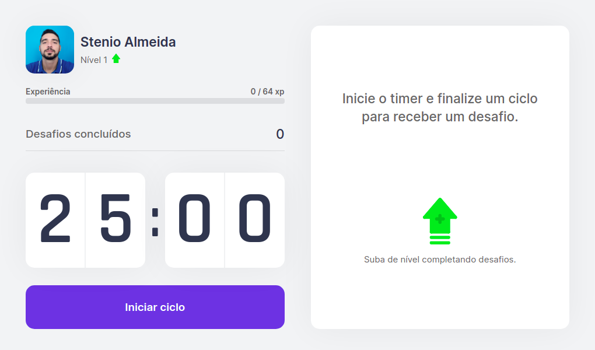
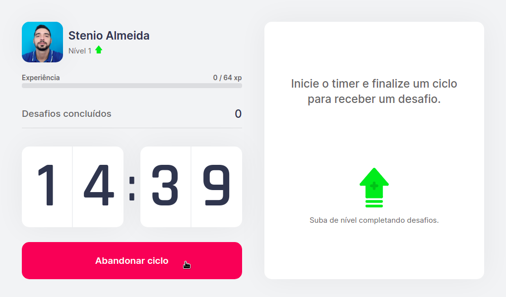
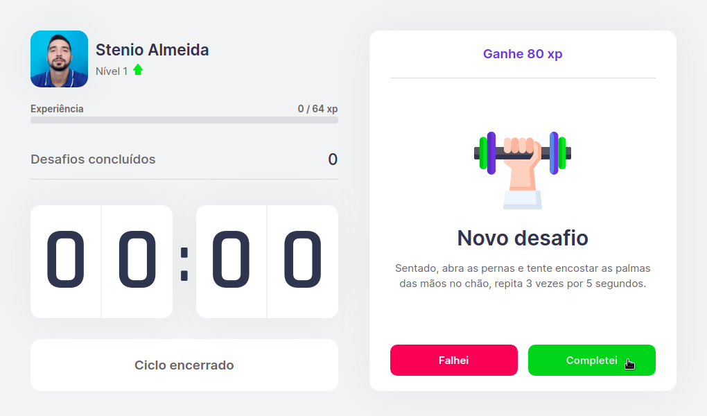
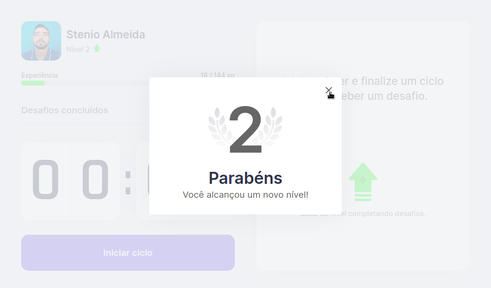

<p  align="center"></p>

<div style="display: flex; align-items:center; justify-content:center; width:100%;">
  <p align="center" style="max-width: 720px; text-align: justify;">Ajudando você a cuidar da sua saúde! Utilizando a técnica de pomodoro, o YouMove proporciona um maior controle do tempo ao estudar, trabalhar, ou realizar a mesma tarefa por um longo período.</p>
</div>

<p align="center">
 <a href="#funcionalidades">Funcionalidades</a> •
 <a href="#tecnologias">Tecnologias</a> • 
 <a href="#obtendo-o-projeto">Obtendo o projeto</a> • 
 <a href="#author">Author</a> • 
 <a href="#unlock-licensa">Licensa</a>
</p>

<hr style="height: 1px">

<p>
  <div style="display: flex; flex-direction: column; justify-content: center; align-items: center; max-width: 100%;">
    <span>• Tela inicial •</span>
    <br/>
    <span>• Ciclo em andamento •</span>
    <br/>
    <span>• Ciclo encerrado •</span>
    <br/>
    <span>• Subindo de nível •</span>
    <br/>
  </div>
</p>

<p align="center">🚧 YouMove 🚀 Em construção... 🚧</p>

<p align="center">Conheça o app <a href="https://youmove.vercel.app">aqui</a>.</p>

<hr style="height: 1px">

## Funcionalidades
* Timer de 25 minutos com notificação visual e auditiva,
* Vários desafios/exercícios que podem serem realizados durante os intervalos,
* Contador de desafios concluídos,
* Classificação por nível.

## Tecnologias


## Obtendo o projeto

```bash
# Clone o repositório
$ git clone https://github.com/stenioas/youmove.git

# Acesse a pasta do projeto
$ cd youmove

# Instale as dependências
$ yarn

# Execute a aplicação
$ yarn dev

# Acesse pelo navegador
http://localhost:3000
```

## :thumbsup: Obrigado!
Agradeço a todos que chegaram até aqui, muito obrigado!

## :unlock: Licensa

O projeto utiliza a licensa <a href="https://github.com/stenioas/youmove/blob/master/LICENSE">MIT</a>, aproveite, use e modifique como quiser!
